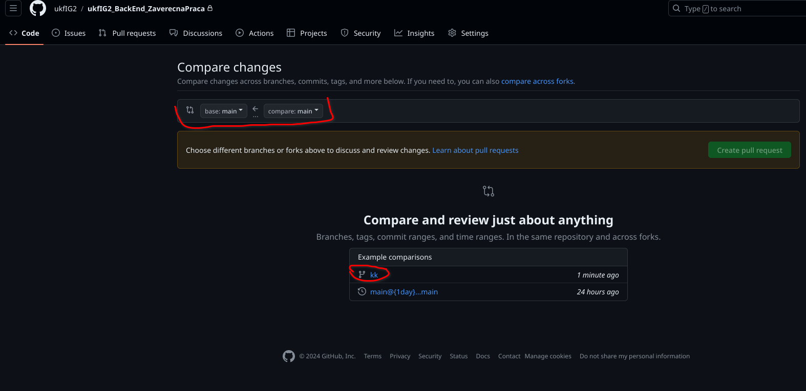
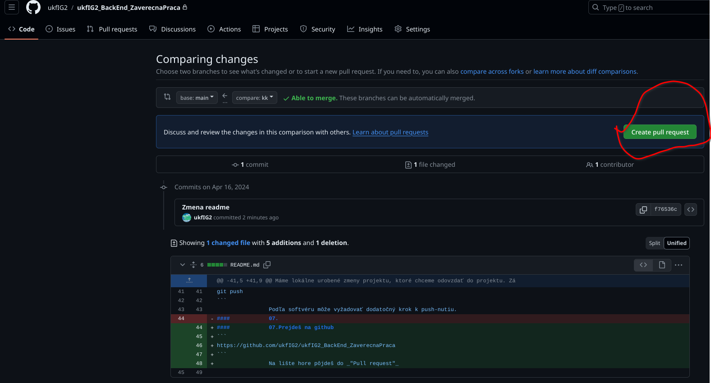
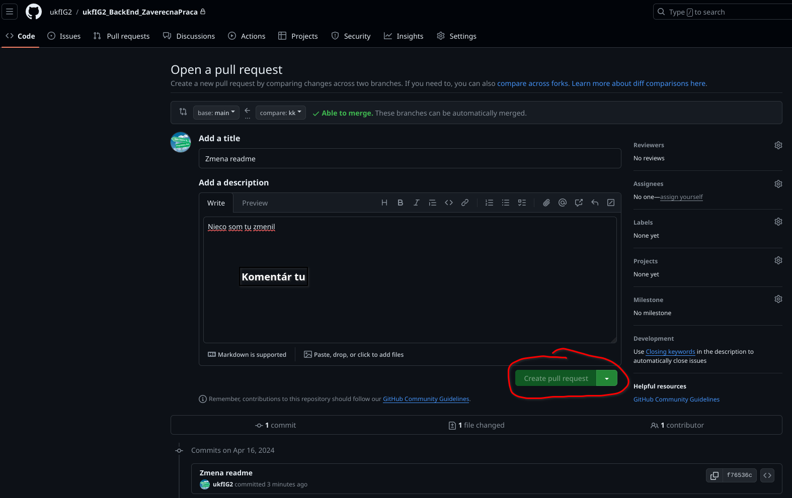

# 	ukfIG2_BackEnd_ZaverecnaPraca
## 	Ako používať GIT

### 	Prve stiahnutie programu
V procese výskumu

## 	Pracovanie na projekte
### 	01.	Ako prvé si overím, či nedošlo k zmenám v projekte.
#### 		01.	Pozrem si, či sa zmenilo niečo v projekte
``` console
git fetch
```
#### 		02.	V prípade zmeny stiahnem zmeny
``` console
git pull
```

###	02. 	Idem robiť zmeny v projekte
####		01.	Vytvorím si lokálne u seba nový branch
```console
git branch <názov tvojej branče bez <> >
```
####		02.	Prepnem sa do tej branče
```console
git switch <názov tvojej branče bez<> >
```
####		03.	Vykonám zmeny v projekte
####		04.	Po vykonaní zmien chceme zoznam súborov, ktoré sme upravovali
Záleži podľa OS a softwaru ktorý používaš sa edit projektu.
Cez terminál to je vo všeobecnosti príkaz "git add"
``` console
git add <nazvy súborov, ktoré si menil/a bez <> >
```
####		05.	Potom tie zmeny chceme zapísať, urobiť o tom záznam
``` console
git commit -m "<Tvoj komentár. V skratke aké zmenym úlohu si robil bez <> >"
```
Máme lokálne urobené zmeny projektu, ktoré chceme odovzdať do projektu. Záleži podľa softwáru, ktorý sa bude používať ako ďalej.
####		06.	Vo všeobecnosti push-neme nami vytvorenú branču do projektu
``` console
git push
```
Podľa softvéru môže vyžadovať dodatočný krok k push-nutiu.
####		07.	Prejdeš na github
```
https://github.com/ukfIG2/ukfIG2_BackEnd_ZaverecnaPraca
```
Na lište hore pôjdeš do _"Pull request"_  -> _New pull request_ -> Zvolíš si branch-u ktorú chceš odovzdať(merg-nuť) -> Zvolíš _Create pull request_ -> _Merge pull request_ -> _Confirm merge_ -> _Delete branch_




####		08.	Odporúčam prepnúť sa do main branche a vymazať branchu v ktorej si robil
``` console
git switch main
git branch -D <názov tvojej branche bez <> >
```

####		09.	Nabudúce ```git status``` == Najlepšie keď povie Nothing to do -> Skontorlovať v ktorej branchi si ```git branch``` a spustiť ```git fetch``` atď.
 
